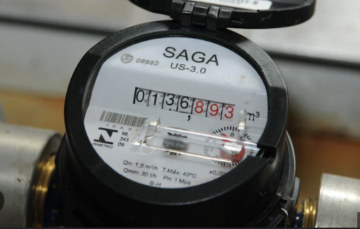
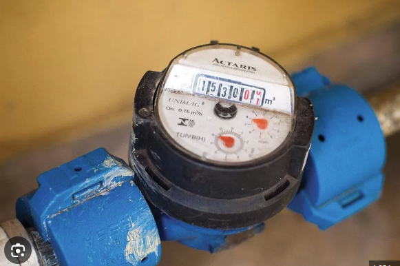
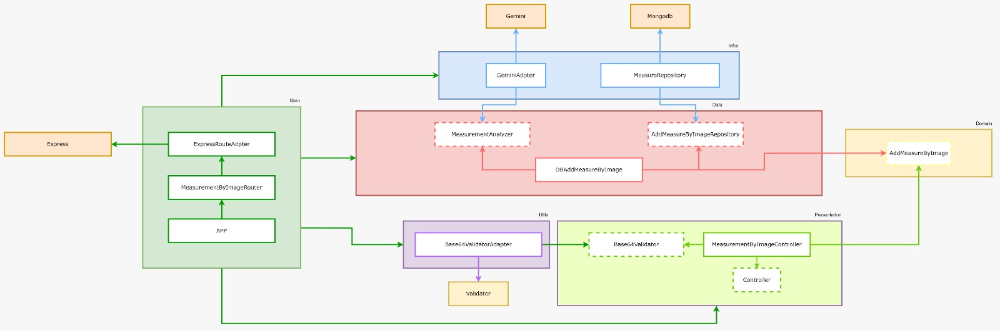

### Teste técnico SHOPPER

### Para rodar o projeto

1. Clone o projeto;
2. Adicione a variável `GEMINI_API_KEY` ao arquivo `.env`
3. Rode o docker (As versões utilizadas foram: Docker version 27.0.3 | Docker Compose version v2.28.1-desktop.1)

```bash
docker-compose up
```

### Endpoints

- POST /upload

Request body:

```json
{
  "image": "BASE64",
  "customer_code": "1",
  "measure_datetime": "2018-11-29T15:30:00Z",
  "measure_type": "WATER" // Ou GAS
}
```

- POST /upload

Request body:

```json
{
  "image": "BASE64",
  "customer_code": "1",
  "measure_datetime": "2018-11-29T15:30:00Z",
  "measure_type": "WATER" // Ou GAS
}
```

- PATCH /confirm

Request body:

```json
{
  "measure_uuid": "944feba8-868f-4770-b7bc-899170236216",
  "confirmed_value": 999999
}
```

- GET /:customer_code/list

Queryparams:

- measure_type = "WATER" ou "GAS"

#### Princípios utilizados

- S.O.L.I.D
- DRY (Don't repeat yourself)

#### Design Patterns utilizados:

- Adapter
- Dependency Injection
- Factory

### libs e tools utilizadas

- Nodejs
- Typescript
- Docker
- Jest
- MongoDB
- Validator
- Express
- tsx
- tsup

### Observações

- É válido lembrar que para alguns requisitos pedidos no teste técnico foi preciso adaptar alguns recursos para suprir as interfaces de retorno.
- Como não foi relatado o tipo de imagem que iria receber no endpoint pedi para o GEMINI capturar o valor e depois tiro os 3 dígitos finais pois a depender do medidor ele usa medidas diferentes, geralmente ficam em vermelho as medições em L, em algumas pesquisas vi que uns usam 2 dígitos e outros 3 dígitos então resolvi optar por remover os 3 útltimos.
- O primeiro endpoint (POST /upload) foi feito baseado na metodologia TDD, o restante fiz sem tests por conta do tempo.
- Duas imagens para teste que utilizei foram:




### Arquitetura do controller de upload (MeasurementImageController)


